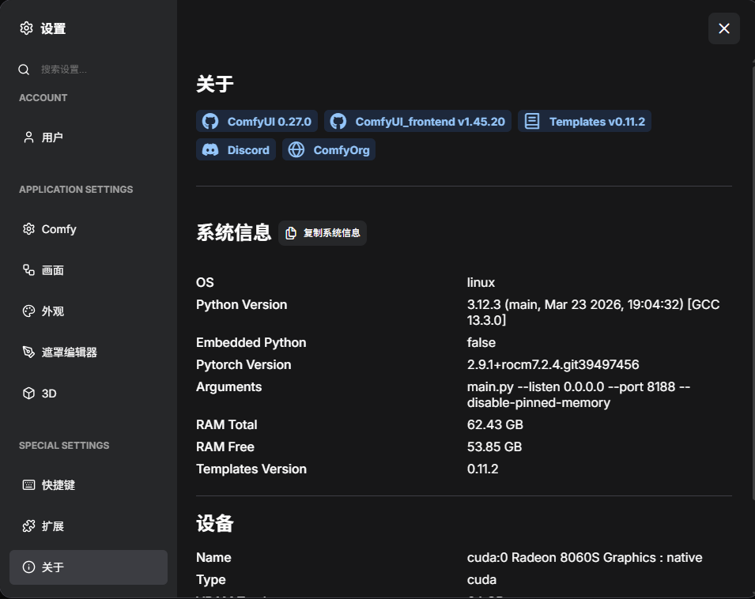

# ComfyUI ROCm Docker Image

🔥 **ComfyUI with AMD ROCm support** - run ComfyUI on AMD GPUs with ROCm-optimized dependencies.

[](https://hub.docker.com/r/qinzhen/comfyui-rocm)
[](https://rocm.docs.amd.com/)
[](https://github.com/Comfy-Org/ComfyUI)
[](https://www.amd.com/)

> [!IMPORTANT]
> The ROCm version installed on the host machine must be compatible with the ROCm version inside this image. This image is built for **ROCm 7.2.4**.

For questions or issues, please open an issue here: <https://github.com/gexqin/ComfyUI-ROCm724-Docker/issues>



*ComfyUI running on AMD ROCm with a sample workflow and generated landscape image.*

## 📋 Version Information

| Component | Version |
| --- | --- |
| Base image | `rocm/pytorch:rocm7.2.4_ubuntu24.04_py3.12_pytorch_release_2.9.1` |
| Python | 3.12.3 |
| PyTorch | 2.9.1 |
| ROCm | 7.2.4 |
| ComfyUI | v0.27.0 |
| Ubuntu | 24.04 |

## ✨ Key Features

- 🎨 **Node-based AI workflow** - visual interface for building AI image generation pipelines.
- 🔥 **AMD ROCm optimized** - native AMD GPU acceleration with ROCm 7.2.4.
- 📦 **Smart model management** - optional automatic model downloads through `MODEL_DOWNLOAD`.
- 🧪 **Tested on AMD hardware** - verified on AMD AI MAX+ 395 configurations.
- 🎯 **Ready to use** - includes practical defaults for running ComfyUI in Docker.
- 💾 **Persistent storage** - models, inputs, outputs, custom nodes, and user data are mounted as local volumes.

## 🚀 Quick Start

Create a `docker-compose.yaml` file:

```yaml
services:
  comfyui-rocm:
    image: qinzhen/comfyui-rocm724
    container_name: comfyui-rocm724
    runtime: runc
    devices:
      - /dev/kfd:/dev/kfd
      - /dev/dri:/dev/dri
    group_add:
      - video
    ports:
      - "8188:8188"
    volumes:
      - ./data/models:/workspace/ComfyUI/models
      - ./data/output:/workspace/ComfyUI/output
      - ./data/input:/workspace/ComfyUI/input
      - ./data/custom_nodes:/workspace/ComfyUI/custom_nodes
      - ./data/user:/workspace/ComfyUI/user
    environment:
      # - MODEL_DOWNLOAD=default
      - HSA_DISABLE_FRAGMENT_ALLOCATOR=1
      - PYTORCH_NO_HIP_MEMORY_CACHING=1
      - TORCH_ROCM_AOTRITON_ENABLE_EXPERIMENTAL=1
      - TORCH_CUDNN_ENABLED=0
      - HIP_LAUNCH_BLOCKING=1
      - TORCH_SHOW_CPP_STACKTRACES=1
      - HSA_OVERRIDE_GFX_VERSION=11.5.1
    restart: unless-stopped
```

Start the container:

```bash
docker compose up -d
```

Open ComfyUI in your browser:

```text
http://0.0.0.0:8188
```

Or, from another machine on the same network, replace `0.0.0.0` with the host machine IP address.

## 📋 Requirements

| Component | Requirement |
| --- | --- |
| GPU | AMD GPU with ROCm-supported RDNA 2 / RDNA 3 / RDNA 4 architecture |
| VRAM | 8 GB minimum, 16 GB or more recommended |
| OS | Linux, Ubuntu 24.04 recommended |
| Docker | Latest official Docker version recommended |
| PyTorch | 2.9.1 + ROCm 7.2.4 |
| ROCm | ROCm 7.2.4 driver/runtime installed on the host |

> [!NOTE]
> `HSA_OVERRIDE_GFX_VERSION` may need to be adjusted depending on your GPU architecture. The default value in this compose file is `11.5.1`, which is intended for AMD AI MAX+ 395 / gfx1151-style environments.

## 🔧 Setup Instructions

### 1. Install ROCm 7.2.4 drivers

Follow the official ROCm Linux installation guide:

<https://rocm.docs.amd.com/projects/install-on-linux/en/latest/install/quick-start.html>

For Ubuntu 24.04, download the ROCm 7.2.4 installer package:

```bash
wget https://repo.radeon.com/amdgpu-install/7.2.4/ubuntu/noble/amdgpu-install_7.2.4.70204-1_all.deb
sudo apt install ./amdgpu-install_7.2.4.70204-1_all.deb
```

Then install ROCm according to your AMD GPU and host environment.

### 2. Verify ROCm installation

```bash
rocminfo
```

The output should show your AMD GPU, for example:

```text
*******
Agent 2
*******
  Name:                    gfx1151
  Uuid:                    GPU-XX
  Marketing Name:          AMD Radeon Graphics
  Vendor Name:             AMD
  Feature:                 KERNEL_DISPATCH
  Profile:                 BASE_PROFILE
  Float Round Mode:        NEAR
  Max Queue Number:        128(0x80)
  Queue Min Size:          64(0x40)
  Queue Max Size:          131072(0x20000)
  Queue Type:              MULTI
  Node:                    1
  Device Type:             GPU
  Cache Info:
    L1:                    32(0x20) KB
    L2:                    2048(0x800) KB
    L3:                    32768(0x8000) KB
  Chip ID:                 5510(0x1586)
```

### 3. Start ComfyUI

```bash
docker compose up -d
```

Check logs if the container does not start correctly:

```bash
docker logs -f comfyui-rocm
```

## ⚡ Performance & Hardware

### Tested Hardware

| Hardware | Memory split | Status |
| --- | --- | --- |
| AMD AI MAX+ 395 | 64 GB / 64 GB | ✅ Tested |

### Tested Templates

| Template | Main model | Status |
| --- | --- | --- |
| `NewBie Exp0.1` | `NewBie-Image-Exp0.1-bf16` | Works, sometimes requires retries |
| `SDXL Turbo` | `sd_xl_turbo_1.0_fp16` | Works well |
| `Z-Image-Turbo Text to Image` | `z_image_turbo_bf16` | Works well |
| `Z-Image-Turbo Fun Controlnet Union` | `z_image_turbo_bf16` | Works well |
| `NetaYume Lumina Text to Image` | `NetaYumev35_pretrained_all_in_one` | Works well |
| `Qwen Image 2512` | `qwen_image_2512_fp8` | Works, requires more than 40 GB system memory |
| `Qwen Image Edit 2511` | `qwen_image_edit_2511_bf16` | Works, requires more than 40 GB system memory |

## 🗂️ Data Volumes

The compose file maps local folders into the container:

| Local path | Container path | Purpose |
| --- | --- | --- |
| `./data/models` | `/workspace/ComfyUI/models` | Model files |
| `./data/output` | `/workspace/ComfyUI/output` | Generated images and outputs |
| `./data/input` | `/workspace/ComfyUI/input` | Input images and assets |
| `./data/custom_nodes` | `/workspace/ComfyUI/custom_nodes` | Custom ComfyUI nodes |
| `./data/user` | `/workspace/ComfyUI/user` | User settings and workflows |

## 🛠️ Troubleshooting

### Host ROCm version mismatch

Make sure the host ROCm driver/runtime is compatible with the container ROCm version. This image targets **ROCm 7.2.4**.

### GPU is not detected

Check the following:

```bash
ls -l /dev/kfd /dev/dri
rocminfo
```

Also confirm that the container has access to `/dev/kfd` and `/dev/dri`, and that the user has permission through the `video` group.

### Incorrect GPU architecture override

If you see HIP/ROCm initialization errors, try adjusting:

```yaml
- HSA_OVERRIDE_GFX_VERSION=11.5.1
```

Use the value that matches your GPU architecture.

### View container logs

```bash
docker logs -f comfyui-rocm
```

## 📄 License & Credits

This project is licensed under GPL-3.0. See the [LICENSE](LICENSE) file for details.

### Third-Party Components

- **ComfyUI**: GPL-3.0 - [ComfyUI](https://github.com/Comfy-Org/ComfyUI)
- **PyTorch**: BSD 3-Clause - [PyTorch](https://pytorch.org/)
- **ROCm**: various OSS licenses - [AMD ROCm](https://rocm.docs.amd.com/)

**Acknowledgments:**

- [ComfyUI](https://github.com/Comfy-Org/ComfyUI) - node-based AI workflow interface.
- [AMD ROCm](https://rocm.docs.amd.com/) - open source GPU computing platform.
- ROCm community - AMD GPU AI support and compatibility knowledge.

---

🔗 **Links:** [Docker Hub](https://hub.docker.com/r/qinzhen/comfyui-rocm) | [GitHub](https://github.com/gexqin/ComfyUI-ROCm) | [ComfyUI](https://github.com/Comfy-Org/ComfyUI)
